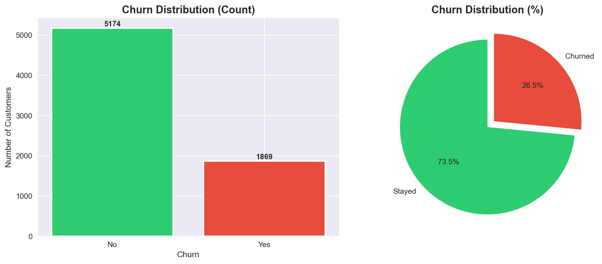
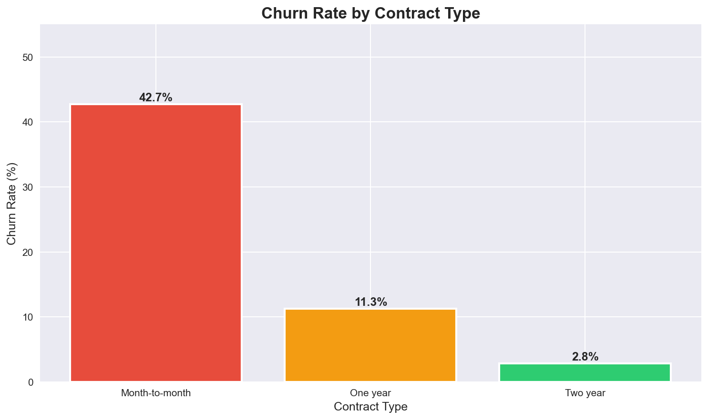

# 📊 Customer Churn Prediction System

An end-to-end Machine Learning system built to predict telecom customer churn and recommend data-driven retention strategies.

## 🚀 Project Overview

Customer churn directly impacts company revenue. This project analyzes customer behavior, billing patterns, service usage, and contract types to identify customers at high risk of leaving.

Two classification models were trained and evaluated:
- Logistic Regression  
- XGBoost Classifier  

The final solution includes a deployed Streamlit web application for real-time churn prediction.

---

## 🧠 Business Value

✔ Identify high-risk customers early  
✔ Enable targeted retention campaigns  
✔ Reduce revenue loss  
✔ Support data-driven decision making  

---

## 🛠 Tech Stack

Python • Pandas • NumPy • Scikit-learn • XGBoost • Matplotlib • Seaborn • Streamlit  

---

## 📂 Dataset

Telco Customer Churn Dataset  
Source: https://www.kaggle.com/blastchar/telco-customer-churn  

---
## 📊 Key Insights from EDA
To understand why customers leave, I analyzed usage patterns and billing data.

| Churn Distribution | Impact of Contract Type |
|---|---|
|  |  |

> **Top Insight:** Customers on "Month-to-Month" contracts are 3x more likely to churn compared to those on "Two-year" contracts.
